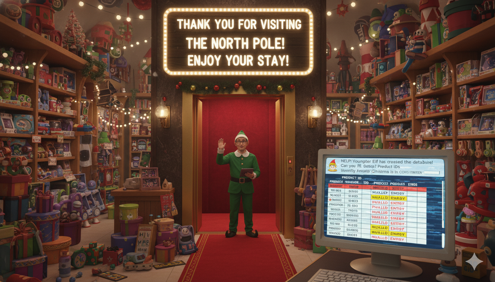

# aoc2025
Advent of code 2025

Totally ready for [Advent of Code](https://adventofcode.com) 2025! 
This year, I'll continue compulsory. 🎄😎 

### How to run
You need to provide your own puzzle inputs. Aoc doesn't allow sharing of one's own input. 
Create a DayX.txt file for each day at the root of the project.

- Run from command line: dotnet run
- Run from your favorite dotnet core IDE

## Day 0
 
Getting ready, decided to use Nano Banana this time to generate me some images. 

## Day 1
 
Traditionally, this one was easy, but part 2 was harder than expected 😅

## Day 2
 
Nice property usage of SumOfN for part 1, (fast) NrOfDigits from previous year Day 11 comes in handy 😃

### Timings and memory usage
| Day    | Time (ms) | Memory (MB) |
|-------:|----------:|------------:|
| Day 2  | 8.0       | 0.0         |
| Day 1  | 2.6       | 0.3         |
|*Total* | *10.6*    | *0.3*       |

Images generated by Nano Banana
